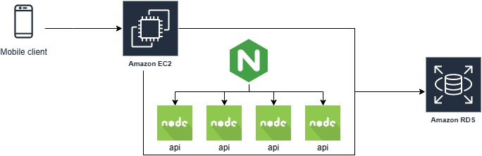
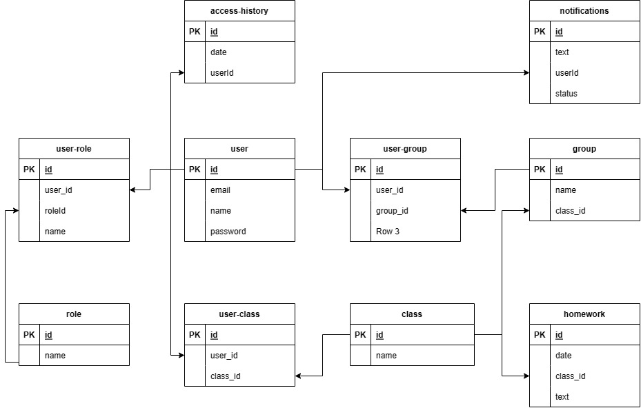

# Arquitetura da Solução

O software será desenvolvido utilizando a arquitetura Rest.  Dessa forma, o usuário terá acesso á aplicação através do aplicativo desenvolvido em React Native.

O aplicativo terá acesso à nossa API, que estará disponível via EC2 na AWS.

Os aplicativos terão seu deploy feito utilizando PM2, que orquestrará as instâncias da aplicação NodeJS.
Em sua frente, teremos um proxy reverso utilizando o NGINX que servirá de Load Balancer para as mesmas.

As instâncias terão acesso ao banco de dados PostgreSQL que estará disponível através do serviço RDS.

## Diagrama de Classes

[//TODO]: # (O diagrama de classes ilustra graficamente como será a estrutura do software, e como cada uma das classes da sua estrutura estarão interligadas. Essas classes servem de modelo para materializar os objetos que executarão na memória. As referências abaixo irão auxiliá-lo na geração do artefato “Diagrama de Classes”.)

## Modelo ER

## Esquema Relacional

O projeto foi desenvolvindo usando o [Draw.io](https://draw.io) e é possível abrir o projeto usando o arquivo do proprio draw.io [aqui](./assets/gruppo-der.drawio)

## Modelo Físico
[//TODO]: # (Entregar um arquivo banco.sql contendo os scripts de criação das tabelas do banco de dados. Este arquivo deverá ser incluído dentro da pasta src\bd.)

## Tecnologias Utilizadas

React Native: utilizaremos o React Native para efetuar o desenvolvimento de um sistema mobile, transformando o código em Typescript em um projeto nativo.

PostgreSQL: utilizaremos o banco de dados PostgreSQL para podermos guardar e relacionar os dados.

NestJS: utilizaremos o framework NestJS para podermos provisionar os endpoints para interação com o sistema via REST.

Nginx: utilizaremos o servidor NGINX para podermos repassar as requisições para as portas corretas e utilizarmos multiplas intancias NodeJS.

NodeJS: runtime e ecossistema principal para desenvolvimento de aplicações utilizando Typescript.

Typescript: superset criado pela microsoft que trás mais robustez ao Javascript.

## Hospedagem

A hospedagem será feita atráves de uma instância EC2 da Amazon Web Services e o banco de dados será uma instância de PostgreSQL usando o serviço RDS.

## Qualidade de Software

Conceituar qualidade de fato é uma tarefa complexa, mas ela pode ser vista como um método gerencial que através de procedimentos disseminados por toda a organização, busca garantir um produto final que satisfaça às expectativas dos stakeholders.

No contexto de desenvolvimento de software, qualidade pode ser entendida como um conjunto de características a serem satisfeitas, de modo que o produto de software atenda às necessidades de seus usuários. Entretanto, tal nível de satisfação nem sempre é alcançado de forma espontânea, devendo ser continuamente construído. Assim, a qualidade do produto depende fortemente do seu respectivo processo de desenvolvimento.

A norma internacional ISO/IEC 25010, que é uma atualização da ISO/IEC 9126, define oito características e 30 subcaracterísticas de qualidade para produtos de software.
Com base nessas características e nas respectivas sub-características, identifique as sub-características que sua equipe utilizará como base para nortear o desenvolvimento do projeto de software considerando-se alguns aspectos simples de qualidade. Justifique as subcaracterísticas escolhidas pelo time e elenque as métricas que permitirão a equipe avaliar os objetos de interesse.

> **Links Úteis**:
>
> - [ISO/IEC 25010:2011 - Systems and software engineering — Systems and software Quality Requirements and Evaluation (SQuaRE) — System and software quality models](https://www.iso.org/standard/35733.html/)
> - [Análise sobre a ISO 9126 – NBR 13596](https://www.tiespecialistas.com.br/analise-sobre-iso-9126-nbr-13596/)
> - [Qualidade de Software - Engenharia de Software 29](https://www.devmedia.com.br/qualidade-de-software-engenharia-de-software-29/18209/)
