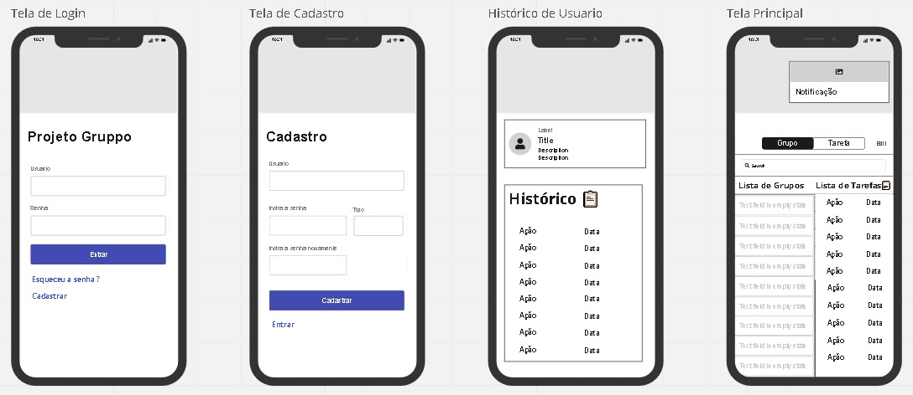

# Programação de Funcionalidades

Pré-requisitos: <a href="2-Especificação do Projeto.md"> Especificação do Projeto</a>, <a href="3-Projeto de Interface.md"> Projeto de Interface</a>, <a href="4-Metodologia.md"> Metodologia</a>, <a href="3-Projeto de Interface.md"> Projeto de Interface</a>, <a href="5-Arquitetura da Solução.md"> Arquitetura da Solução</a>

Implementação do sistema descritas por meio dos requisitos funcionais e/ou não funcionais. Deve relacionar os requisitos atendidos os artefatos criados (código fonte) além das estruturas de dados utilizadas e as instruções para acesso e verificação da implementação que deve estar funcional no ambiente de hospedagem.

Para cada requisito funcional, pode ser entregue um artefato desse tipo

Segue requisitos Funcionais especificados em cada tela:

| ID     | Descrição do Requisito                                 | Respectiva tela      |
| ------ | ------------------------------------------------------ | ---------------------|
| RF-001 | Permitir cadastro ao APP                               | Segunda imagem       |
| RF-002 | Tela inicial deve conter o botão de login              | Primeira imagem      |
| RF-003 | Permitir acesso dos usuários a tela de tarefas/grupos  | Terceira imagem      |
| RF-004 | Permitir criação de grupos pelos usuários              | Quarta imagem        |
| RF-005 | Permitir criação de tarefas pelos usuários (professor) | Quarta imagem        |
| RF-006 | Apresentar o prazo para cada atividade gerada          | Quarta imagem        |
| RF-007 | Tela de Histórico do Usuário                           | Terceira imagem      |
| RF-008 | Notificações de prazos de entrega das tarefas          | Quarta imagem        |

- Assim que a equipe der início a criação do back-end para o aplicativo, será inserido as imagens com os códigos utilizados para a criação de cada tela!
